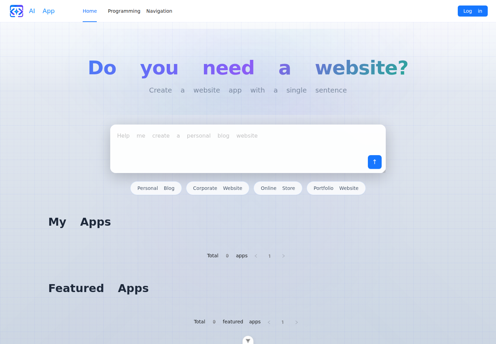
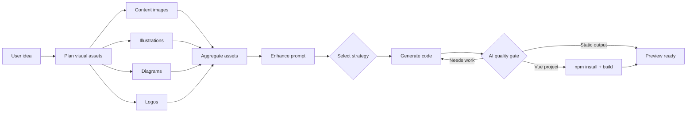
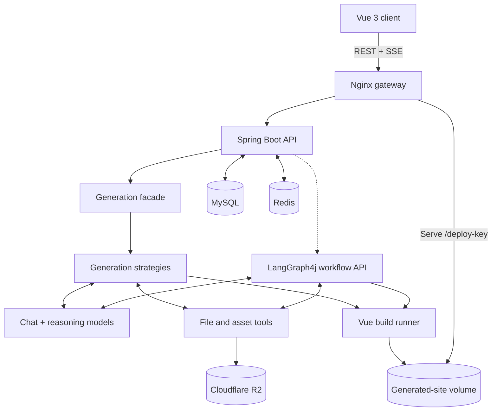

  

<h1 align="center">AI Web Generator</h1>

  A full-stack AI agent that turns a plain-English idea into a working, editable, and deployable website.

  <a href="https://ai-web-generator.bookmountain.work"><strong>Live demo →</strong></a>
  &nbsp;·&nbsp;
  <a href="#engineering-highlights">Engineering highlights</a>
  &nbsp;·&nbsp;
  <a href="#system-design">System design</a>

  
  
  
  
  
  

## What I built

AI Web Generator is more than a prompt-to-HTML wrapper. It is an end-to-end application-generation platform that coordinates language models, tools, build processes, persistent memory, browser automation, and a real-time frontend.

A user can describe a website in one sentence, watch the agent work, preview the result, select a specific DOM element to refine it through conversation, and then deploy or download the generated source.

The platform supports three generation strategies:

- **Single-page HTML** for fast, lightweight output
- **Multi-file websites** for structured static applications
- **Vue projects** for richer applications that require tool calling and a build step

## Engineering highlights

### Agentic workflow orchestration

Alongside the product's direct generation path, I built an advanced LangGraph4j workflow behind dedicated workflow endpoints. It models how the platform can evolve beyond one oversized model call: the graph plans required assets, fans out into parallel collectors for content images, illustrations, diagrams, and logos, enriches the prompt, selects a generation strategy, writes the project, checks code quality, and conditionally retries or builds the result.

This makes the AI process observable, testable, and extensible: new capabilities can be introduced as nodes without rewriting the entire generation pipeline.

### Transparent tool-calling runtime

The Vue agent can read, write, modify, and delete project files instead of returning an unreliable wall of code. A central tool manager registers the tools, while a custom stream protocol distinguishes model text, tool requests, and tool results. Those events are sent to the browser as they happen, turning an otherwise opaque agent loop into visible progress.

### Real-time generation experience

The Spring backend exposes generation as a Reactor `Flux` over Server-Sent Events. The Vue client consumes the stream with `EventSource`, progressively renders the response, handles structured business errors, and refreshes the preview when generation completes. Long model calls therefore remain interactive instead of looking like a frozen request.

### Visual editing across iframe boundaries

The visual editor injects a selection script into the preview iframe and uses `postMessage` to return a stable selector, page path, element text, and bounding box. That context is appended to the next prompt, allowing instructions such as “make this heading smaller” to target the selected element rather than regenerate the entire page blindly.

### Stateful, multi-user AI conversations

Chat messages are stored durably in MySQL, while LangChain4j conversation memory is persisted in Redis and isolated by application ID. Caffeine caches application-specific AI service instances to avoid repeatedly reconstructing memory and tools. This preserves context across multiple refinement turns without mixing one user's project with another.

### Reliability, concurrency, and cost control

- Parallel workflow branches collect independent assets concurrently.
- Java 21 virtual threads handle background cover capture and streaming workflow execution without tying up platform threads.
- Prototype-scoped streaming model instances avoid unsafe shared state under concurrent generation.
- Prompt guardrails reject unsafe input before it reaches the model.
- A Redisson token-bucket limiter supports user-, IP-, and API-level policies through a reusable Spring AOP annotation.
- Redis caching reduces repeated reads for featured applications.
- Fast and reasoning models are separated by task, keeping simple routing work away from the more expensive generation model.

### Production delivery

The repository includes multi-stage frontend and backend Docker builds, health-gated Docker Compose services, Nginx routing for the SPA, API, and generated sites, persistent volumes, and a GitHub Actions pipeline that verifies both builds before deploying to a self-hosted VPS runner.

## Technology stack

| Area | Stack | What it demonstrates |
| --- | --- | --- |
| AI engineering | LangChain4j, LangGraph4j, DeepSeek/OpenAI-compatible models, tool calling, prompt guardrails | Agent design, workflow state, model routing, memory, and structured streaming |
| Backend | Java 21, Spring Boot 3.5, Reactor, Spring AOP, MyBatis-Flex | API design, asynchronous workloads, design patterns, authorization, and persistence |
| Data and performance | MySQL 8, Redis, Redisson, Caffeine | Durable data, distributed sessions, conversation memory, caching, and rate limiting |
| Frontend | Vue 3, TypeScript, Vite, Pinia, Vue Router, Ant Design Vue | Typed UI development, real-time state, reusable components, and admin workflows |
| Browser and build automation | Selenium, WebDriverManager, Node.js, npm, Mermaid CLI | Headless screenshots, generated-project builds, and automated asset creation |
| Infrastructure | Docker, Docker Compose, Nginx, GitHub Actions, Cloudflare R2 | Reproducible builds, reverse proxying, CI/CD, persistent storage, and deployment |

## System design

## Key technical decisions

| Challenge | Implementation | Reasoning |
| --- | --- | --- |
| Support very different output formats | Strategy/factory selection behind a single generation facade | Keeps controllers independent of model and file-format details |
| Make AI actions visible | Typed stream messages for model output, tool requests, and tool results | Improves user trust and makes agent failures easier to diagnose |
| Preserve refinement context | MySQL history + Redis chat memory keyed by application | Combines durable audit history with fast model context retrieval |
| Safely reuse stateful AI services | Caffeine cache keyed by application and generation type | Avoids expensive reconstruction while preserving tenant isolation |
| Generate richer visual output efficiently | Parallel fan-out/fan-in asset collection | Independent network and model calls do not need to block one another |
| Prevent broken Vue output from being treated as complete | Real npm builds in the product path; AI quality-check and regeneration loop in the workflow path | Validates build correctness now and demonstrates a path to semantic validation |
| Target edits precisely | iframe script injection + `postMessage` element metadata | Gives the model concrete DOM context rather than a vague visual request |
| Protect an expensive public endpoint | Declarative Redisson rate limiting and input guardrails | Controls abuse, model cost, and unsafe prompts at the boundary |

## What this project demonstrates

- I can build an **AI product**, not just call an LLM API.
- I understand how to break an agent into **stateful, conditional, and concurrent workflow nodes**.
- I can connect AI execution to a polished **real-time frontend experience**.
- I can design **multi-tenant memory and persistence** without leaking context across projects.
- I apply backend patterns—facade, factory, strategy, template method, and AOP—to keep a complex system maintainable.
- I can take a full-stack system through **containerization, health checks, reverse proxying, CI, and deployment**.
- I think about failure modes: invalid prompts, hallucinated tools, rate limits, build timeouts, partial streams, and generated code that does not compile.

## Explore the implementation

| Area | Start here |
| --- | --- |
| Concurrent AI workflow | [`CodeGenConcurrentWorkflow.java`](src/main/java/com/book/aiwebgenerator/langgraph4j/CodeGenConcurrentWorkflow.java) |
| Workflow nodes | [`langgraph4j/node`](src/main/java/com/book/aiwebgenerator/langgraph4j/node) |
| AI service and memory lifecycle | [`AiCodeGeneratorServiceFactory.java`](src/main/java/com/book/aiwebgenerator/ai/AiCodeGeneratorServiceFactory.java) |
| Agent file tools | [`ai/tools`](src/main/java/com/book/aiwebgenerator/ai/tools) |
| Streaming event handling | [`JsonMessageStreamHandler.java`](src/main/java/com/book/aiwebgenerator/core/handler/JsonMessageStreamHandler.java) |
| Visual DOM editor | [`visualEditor.ts`](client/src/utils/visualEditor.ts) |
| Real-time generation UI | [`AppChatPage.vue`](client/src/pages/app/AppChatPage.vue) |
| Distributed rate limiter | [`RateLimitAspect.java`](src/main/java/com/book/aiwebgenerator/ratelimiter/aspect/RateLimitAspect.java) |
| Production topology | [`compose.yml`](compose.yml) and [`nginx.conf`](deploy/nginx.conf) |
| CI/CD pipeline | [`deploy.yml`](.github/workflows/deploy.yml) |

## Product capabilities

- Authentication, sessions, role-based administration, and user management
- Prompt-to-site generation with automatic strategy selection
- Live agent/tool progress and in-browser application previews
- Multi-turn refinement and click-to-edit visual targeting
- Application gallery and featured-project management
- One-click deployment, shareable URLs, cover capture, and ZIP download
- Chat-history administration with cursor-based pagination
- Automated stock images, illustrations, logos, and Mermaid diagrams

## Engineering roadmap

The next production-scale steps would be to run generated-code builds in disposable sandboxes, move long-running workflows onto a durable job queue, and add OpenTelemetry traces plus token/cost dashboards. Those changes would improve workload isolation, recovery, horizontal scaling, and operational visibility without changing the product experience.

## Acknowledgements

The original product concept was inspired by the AI no-code application course from [Yupi / CodeFather](https://www.codefather.cn/). This repository contains my implementation and extensions, including the concurrent asset workflow, guardrails, distributed rate limiting, Cloudflare R2 integration, Docker deployment topology, and CI/CD pipeline.
